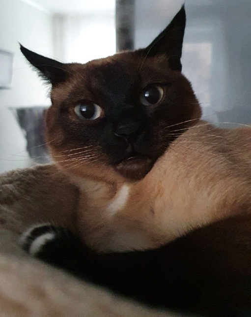

# Aleksei Zharskii   
  
## Contacts: 
* **E-mail:** aleksei-zharskii@gmail.com;
* **Discord:** Aleksei.Zharskii#0032;
* **VK:** https://vk.com/id47621951;
## About me:   
My purpose is to become a front-end developer. I have no experience in IT, but I believe that this will not prevent me from successfully completing my studies in this course.  
## Skills:  
* Basic knowledge of JavaScript, HTML, and CS;
* Basic knowledge of GitHub.  
## Code examples:   
```html
<h2>Contacts:</h2>
<ul>
  <li><span class='first-word'>E-mail:</span> aleksei-zharskii@gmail.com;</li>
  <li><span class='first-word'>Discord:</span> Aleksei.Zharskii#0032.</li>
</ul>
<h2>About me:</h2>
<p>My purpose is to become a front-end developer. I have no experience in IT, but I believe that this will not prevent me from successfully completing my studies in this course. </p>
```
