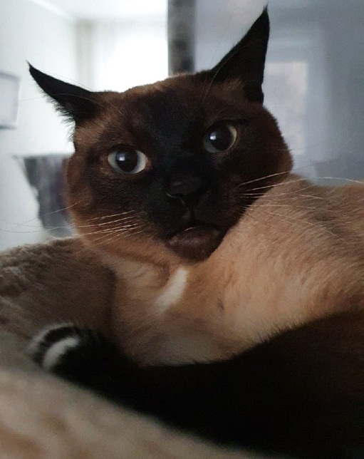

# Aleksei Zharskii   
  
## Contacts: 
* **E-mail:** aleksei-zharskii@gmail.com;
* **Discord:** Aleksei.Zharskii#0032;
* **VK:** https://vk.com/id47621951;
## About me:   
My purpose is to become a front-end developer. I have no experience in IT, but I believe that this will not prevent me from successfully completing my studies in this course.  
## Skills:  
* Basic knowledge of JavaScript, HTML, and CS;
* Basic knowledge of GitHub.  
## Code examples:   
К сожалению, не могу привести пример кода, так как не кодил еще.  
## Work experience:   
 No experience in the IT.  
## Education: 
* 2013-2017, Samara State Technical University, Heat Power Engineering Faculty, Bachelor's degree;
* 2017-2019, Samara State Technical University, Electrical Engineering Faculty, Master's degree.
## Level of English:  
А2 - elementary.  
